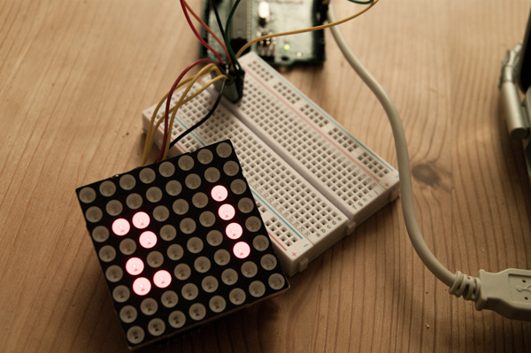

# OlimexLEDMatrix
Arduino Library for interfacing a single Olimex (RGB and non-RGB) 8x8 Matrix

## Installation
Download the zip file and unpack it into its own Folder within your Arduino Sketchbooks library folder. 
(OS X: ~/Documents/Arduino/libraries/OlimexLedMatrix)

## Getting started
Check matrixExample for information on how to use the library.

The non RGB matrix needs the three pins to which the matrix is connected in its constructor. (check Examples)

The RGB Matrix uses the SPI library, which means that it needs to be connected to the SPI pins. Usualy: CLOCK: 13, DATA: 10. The LATCH pin can be any pin and has to be supplied in the constructor.

Since the Single Color Matrix does not support multiplexing, it has to be done by the arduino, so matrix.display() function has to be called in every loop.

The RGB Matrix does support multiplexing, it just has to be called on update.

